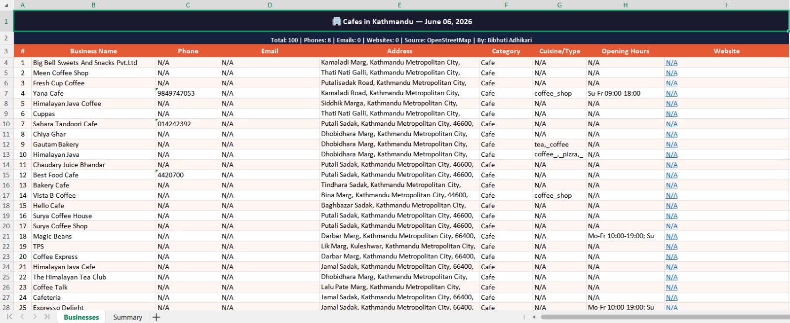

# 🏢 Business Directory Scraper

Python scraper that extracts business data
from OpenStreetMap for any city worldwide
and exports to clean Excel output.

## 📸 Output Preview

## 📊 Data Collected
- Business Name
- Phone Number
- Email
- Address
- Category
- Opening Hours
- Website

## 🛠️ Technologies
- Python 3
- Requests
- OpenStreetMap / Nominatim
- OpenPyXL

## ▶️ How to Run
pip install requests openpyxl
python business_scraper.py

## 🔎 Change Search
SEARCH_TERM = "cafe"
CITY        = "Kathmandu"

## 👤 Author
Bibhuti Adhikari — [bibhutiportfolio.vercel.app](https://bibhutiportfolio.vercel.app)

